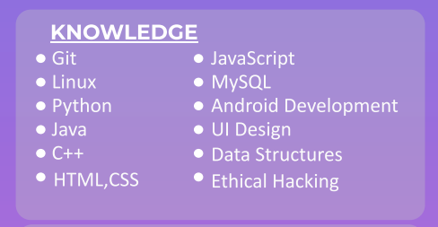

# Hi there, I'm **Deepraj Biadya** 👋

### Here are some ideas to get you started:

    - 🔭 I’m currently a ...Student
    - 🌱 I’m currently learning ... Java, C++, Ethical Hacking
    - 🤔 I’m looking for help ... with Machine Learning
    - 💬 Ask me about ...Myself😁
    - 📫 How to reach me: [deeprajbaidya.com](https://sites.google.com/view/deeprajbaidya)
    - 😄 Pronouns: He/Him

## <u>I'm a Student Developer</u>😊😁!!

    - 🌱 I’m currently learning everything 🤣.
    - 👯 I’m looking to collaborate with other Student Dev's.
    - 🥅 2021 Goals: Contribute more to Open Source projects.
    - ⚡ Fun fact: I love to play Football.
    - 💻 Learning Ethical Hacking.
    - 🎇 Machine Learning Entusiast.

### Latest Project Updates! 🎊🔥🔥🔥🔥

  
:zap: Recent GitHub Activity

  
<!--START_SECTION:activity-->
1.  Password Generator in [deepraj02/deepraj02](https://github.com/deepraj02/PassWord_Generator-GUI-)
2.  QR-code Generator in [deepraj02/deepraj02](https://github.com/deepraj02/QR_Code_Generator-GUI-)
3.  Digital Clock in [deepraj02/deepraj02](https://github.com/deepraj02/Digital_Clock)
4. 🎉 Merged PR  in [MKBHD-alpha/MKBHD-alpha](https://github.com/MKBHD-alpha/AI-Assistant-with-Python)
5. PR Periodic Table Elements--GUI Version in [bananaman441/periodictableGUI](https://github.com/deepraj02/periodictableGUI)
<!--END_SECTION:activity-->

 

## Contact Me...

    
:zap: Contact Details😄😃

My Github: [GitHub](https://github.com/deepraj02)
 
Instagram: [Instagram](https://www.instagram.com/deeprajbaidya02/?hl=en)
 
Website: [Hi,I am Deepraj](https://sites.google.com/view/deeprajbaidya)
 
Email: deeprajbaidya06@gmail.com

